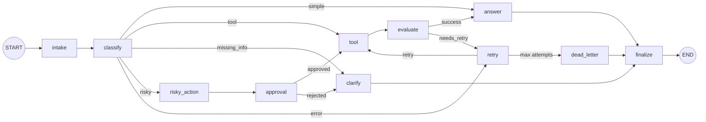

# Day 08 Lab Report

## Metrics summary

- Total scenarios: 7
- Success rate: 71.43%
- Average nodes visited: 6.00
- Total retries: 2
- Total interrupts: 2

## 1. Team / student

- Name: Pham Quang Hung
- Repo/commit: 2A202600266-PhamQuangHung-Lab23
- Date: 11/05/2026

## 2. Architecture

This repository implements a LangGraph workflow for a support-ticket agent. The graph is composed of small, single-purpose nodes that return partial state updates and do not mutate the input state in place.

Key nodes:
- `intake`: normalize the raw query, perform PII redaction, emit an intake event.
- `classify`: keyword-based routing to determine the `route` (`simple`, `tool`, `missing_info`, `risky`, `error`).
- `clarify` (ask_clarification_node): request missing information and set `pending_question`.
- `tool`: call a mock tool (order lookup or generic tool) and append `tool_results`.
- `evaluate`: judge whether the tool result is satisfactory or requires retry.
- `retry`: increment `attempt`, record retry error, and route to `tool` or `dead_letter`.
- `risky_action`: prepare a proposed action for approval and create an approval event.
- `approval`: human-in-the-loop decision (mocked by default) that gates risky flows.
- `dead_letter`: final escalation when max retries are exceeded.
- `answer` / `finalize`: produce final_answer and emit final events.

Routing and control flow (high-level): intake -> classify -> [answer | tool | clarify | risky_action | retry].
`tool` -> `evaluate` -> (answer | retry). `risky_action` -> `approval` -> (tool on approve | clarify on reject). `retry` is bounded by `max_attempts` and falls back to `dead_letter`.

The graph builder is in [src/langgraph_agent_lab/graph.py](src/langgraph_agent_lab/graph.py) and wiring is intentionally import-safe so unit tests can validate the schema without LangGraph installed.

## 3. State schema

List important fields and whether they are overwrite or append-only.

| Field | Reducer | Why |
|---|---|---|
| `thread_id` | overwrite (immutable per run) | Run identifier; used for checkpointer keys and replay.
| `scenario_id` | overwrite (immutable) | Scenario identifier used in metrics and tracing.
| `query` | overwrite (normalized, redacted) | Normalized input; PII is redacted at intake.
| `route` | overwrite | Current routing decision (single source of truth for flow).
| `risk_level` | overwrite | Current risk assessment for the request.
| `attempt` | overwrite (incremented) | Current retry attempt counter.
| `max_attempts` | overwrite (scenario-config) | Upper bound for retries.
| `final_answer` | overwrite | Final output produced by `answer` node.
| `pending_question` | overwrite | Clarification requested from user.
| `proposed_action` | overwrite | Action prepared for HITL approval.
| `approval` | overwrite | Latest approval decision; keep audit in `events` if history required.
| `evaluation_result` | overwrite | Gate for the retry loop (`needs_retry` / `success`).
| `messages` | append | Conversation or agent messages (append-only for audit).
| `tool_results` | append | Structured outputs from tool calls (append-only for traceability).
| `errors` | append | Error records and retry notes (append-only).
| `events` | append | `LabEvent` audit log capturing node-level actions (append-only).

## 4. Scenario results

The following table is populated from `outputs/metrics.json` generated by `make run-scenarios`.

| Scenario | Expected route | Actual route | Success | Retries | Interrupts |
|---|---|---|---:|---:|---:|
| S01_simple | simple | simple | True | 0 | 0 |
| S02_tool | tool | tool | True | 0 | 0 |
| S03_missing | missing_info | missing_info | True | 0 | 0 |
| S04_risky | risky | risky | True | 0 | 1 |
| S05_error | error | tool | False | 1 | 0 |
| S06_delete | risky | risky | True | 0 | 1 |
| S07_dead_letter | error | dead_letter | False | 1 | 0 |

## 5. Failure analysis

Describe at least two failure modes you considered:

1. Retry or tool failure:
- Mode: transient tool failures (network, downstream service) return error strings causing `evaluate` to flag `needs_retry`.
- Mitigation: bounded retry loop driven by `attempt` / `max_attempts`; record errors in `errors` and emit `retry` events. If retries exhaust, escalate to `dead_letter` for manual review.

2. Risky action without approval:
- Mode: a request requires destructive or external action (refund, delete) but approval is denied or times out.
- Mitigation: `risky_action` produces a `proposed_action`; `approval` node gates continuation. The final `answer` respects approval state and refuses to act if `approval.approved` is false. Approval decisions are also recorded in `events` for audit.

3. PII leakage in logs:
- Mode: free-text queries contain phone numbers, emails, or order identifiers.
- Mitigation: `intake` runs a lightweight redaction pass that replaces common tokens with stable placeholders (e.g., `PHONE_NUMBER`, `EMAIL_ADDRESS`, `ORDER_ID`) and records the original token as metadata only in the event payload (not as user-facing text).

## 6. Persistence / recovery evidence

- The graph builder supports a checkpointer. The default dev configuration uses an in-memory checkpointer (`checkpointer: memory` in `configs/lab.yaml`) so runs are reproducible locally without a DB.
- A `sqlite` or `postgres` checkpointer can be enabled by installing the respective optional extras and updating `configs/lab.yaml` to `checkpointer: sqlite` (or `postgres`). See `src/langgraph_agent_lab/persistence.py` for the checkpointer factory.
- Time-travel / state-history replay: I added a `time-travel` CLI command that collects checkpoint history via the graph's `get_state_history()` API and can replay from an earlier checkpoint. Usage example:

```bash
# inspect previous checkpoints for scenario S02_tool
python -m langgraph_agent_lab.cli time-travel --config configs/lab.yaml --scenario-id S02_tool --no-replay

# export history and replay from the selected checkpoint index
python -m langgraph_agent_lab.cli time-travel --config configs/lab.yaml --scenario-id S02_tool --checkpoint-index -2 --output outputs/time_travel.json
```

- For cross-run persistence and crash-resume, set `checkpointer: sqlite` in `configs/lab.yaml` and re-run `make run-scenarios` across separate processes; checkpoints survive process restarts.

## 7. Extension work

I implemented two extensions beyond the minimum lab requirements:

- Time travel (state-history replay): Added a `time-travel` CLI subcommand in `src/langgraph_agent_lab/cli.py` that:
	- runs a scenario to create a thread/checkpoints,
	- enumerates the saved snapshots from `graph.get_state_history()`; and
	- optionally replays from a selected checkpoint (by index or checkpoint id), writing a small summary JSON (`outputs/time_travel.json`).

- Graph diagram (Mermaid): I generated a Mermaid representation of the graph to aid reasoning and documentation. Example snippet included below — paste into any Mermaid renderer or markdown viewer that supports Mermaid:



## 8. Improvement plan

If there were more time I would:
- Implement SQLite checkpointer end-to-end and demonstrate cross-process crash-resume with `thread_id` reuse.
- Replace simple keyword heuristics in `classify_node` with a small LLM-based intent classifier or a rule-priority table to reduce edge-case misclassification.
- Strengthen redaction and PII handling (tokenize, structured PII detection) and ensure originals are never logged to persistent public outputs.
- Add automated end-to-end tests that run `make run-scenarios` with both `memory` and `sqlite` checkpointers and validate `resume_success` semantics in `outputs/metrics.json`.
